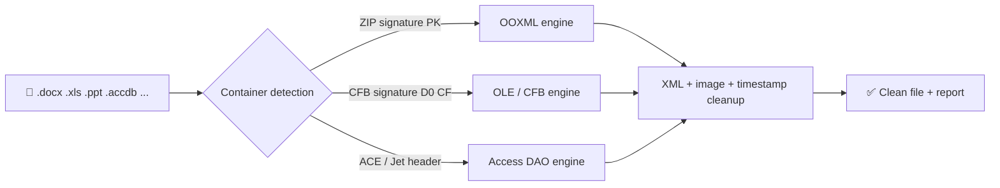

<p align="center">🌐 <b>English</b> | <a href="README.md">Русский</a></p>

<p align="center">
  
</p>

<h1 align="center">OfficeMetaCleaner 🧹</h1>

<p align="center">
  <b>Removes hidden metadata from Microsoft Office files — while keeping them fully working.</b><br/>
  Author, company, edits, geotags in photos, hidden database properties — all wiped in seconds.
</p>

<p align="center">
  
  
  
  
  
  <a href="LICENSE"></a>
</p>

<p align="center">
  <code>GUI (drag &amp; drop)</code> · <code>CLI (omc)</code> · <code>OOXML</code> · <code>OLE / CFB</code> · <code>Access</code> · <code>EXIF in images</code>
</p>

> 📥 **Download ready builds (Windows x64, no .NET needed):** the
> **Releases** page of this repo — `OfficeMetaCleaner-win-x64.zip` (GUI) and `omc-win-x64.zip` (CLI).
> The console archive includes a quick-start `README.txt`.
> Every `v*.*.*` tag automatically builds fresh portable `.exe` files via GitHub Actions.

---

## ✨ What is it and why

Every `.docx`, `.xlsx`, `.pptx`, `.doc`, `.mdb` stores far more than you see on screen:

> 👤 who created and edited it · 🏢 company and machine · 🕒 when and how long it was edited ·
> 📸 where and with what embedded photos were taken · 💬 who commented what · ✍️ digital signatures

Sending such a file to a client, a court, with your CV, or posting it publicly means sending all of that too.

**OfficeMetaCleaner** is a "make this file safe" button:

- drop files or a folder into the window — get clean copies back;
- or batch-process via the `omc` console tool in scripts and CI;
- everything works **strictly locally**, no cloud, no uploads;
- content, formatting, formulas, macros and tracked edits are **untouched** — only the metadata layer is cut.

---

## 🚀 Features

| | |
|---|---|
| 🖱️ **Drag & Drop GUI** | Drop files and folders right into the window. Folders are scanned recursively, UI never freezes |
| 📋 **Honest per-file report** | Click / double-click a row to open a "what exactly was removed" window: `[core-props] docProps/core.xml — part removed` |
| ⚙️ **Settings with hints** | EXIF cleanup in images, signature removal, waiting for locked files, Word/PowerPoint privacy flags |
| 🔁 **Smart re-runs** | Already processed files are skipped. "Reset marks" button processes them again |
| 📂 **Flexible output** | Copy next to the original in `cleaned/`, into your own folder — or replace the source with `--in-place` |
| 🔒 **Waits for open files** | Sees the `~$...` lock file, processes free files first, locked ones — as they close. `Cancel` / `Ctrl+C` — no losses |
| 🧪 **`--dry-run`** | "Show what would be removed without writing anything" mode — for audits |
| 🛡️ **Atomic writes** | A temp file next to the target first, then replacement. A crash halfway = source intact |

---

## 🧠 How it works



No "rebuilding the document with a third-party library". Each format is cleaned its native way:

### 1. OOXML (`.docx .docm .xlsx .xlsm .pptx .pptm .vsdx` …) — ZIP/OPC surgery

The document is opened as a ZIP archive and patched precisely:

- 🗑️ `docProps/core.xml`, `app.xml`, `custom.xml`, `thumbnail.*` parts are removed;
- 🔗 `[Content_Types].xml` and `*.rels` are cleaned in sync so the package stays valid;
- 🧽 remaining XML is scrubbed of `author`, `initials`, `creator`, `lastModifiedBy`, `company`, `manager`, `codeName`, dates — and **all `rsid`** (editing-session marks);
- 🛡️ privacy flags are set so Word/PowerPoint don't accumulate junk going forward:
  `removePersonalInformation` in `word/settings.xml`, `removePersonalInfoOnSave="1"` in `ppt/presentation.xml` (Excel simply has no such flag in the format);
- 🕒 ZIP entry timestamps are normalized to a fixed date;
- 📦 `vbaProject.bin` and everything else is **untouched**, macros survive.

### 2. Legacy OLE/CFB (`.doc .xls .ppt .msg .vsd`) — via OpenMcdf

- the container is rebuilt into a new file;
- `SummaryInformation` and `DocumentSummaryInformation` streams are replaced with empty property sets **in place**, the tail is zeroed — old values don't linger even in the stream slack.

### 3. Microsoft Access (`.accdb .accde .accdr .accdt .mdb .mde`) — via DAO

This is neither ZIP nor CFB but the ACE/Jet format, so properties are fixed via `DAO.DBEngine.120`:

- `SummaryInfo` and `UserDefined` document properties are removed (Title, Author, Company, Keywords …);
- `AppTitle` and `AppIcon` are removed too (the icon may contain a local path);
- the database is then **compacted** — otherwise old values would remain in freed pages.

> ⚠️ Access requires installed Microsoft Access or Access Database Engine.
> If the driver is missing, the tool says so honestly and **leaves the file untouched**.

### 4. Images inside documents (`media/*`) — enabled by default

Pixels never change, only the metadata layer is cut:

| Format | What is removed |
|---|---|
| **JPEG** | APP1 Exif/XMP, APP13 Photoshop/IPTC (incl. geotags, camera model) |
| **PNG** | `eXIf`, `tEXt`, `iTXt`, `zTXt`, `tIME` chunks |
| **GIF** | comments and XMP application extension |

Disable with `--keep-images` / the GUI checkbox.

---

## 🧾 What gets cleaned — at a glance

| Where it hides | Example | After cleaning |
|---|---|---|
| File properties | Author, company, title, keywords | ❌ removed |
| Edit history | `rsid`, `lastModifiedBy`, editing time | ❌ removed (the edits themselves stay!) |
| Privacy settings | Word/PowerPoint accumulate authors on every save | ✅ switched to "don't accumulate" |
| Embedded photos | GPS, camera, shooting date, XMP | ❌ removed, photos intact |
| Legacy `.doc/.xls/.ppt` | SummaryInformation in stream slack | ❌ zeroed |
| Access databases | SummaryInfo, AppTitle, paths in AppIcon | ❌ removed + compact |
| ZIP internals | entry timestamps | 🕒 normalized to `2000-01-01` |
| `_xmlsignatures/*` signatures | digital signatures | ⚠️ only with `--remove-signatures` |

### ❌ What is deliberately NOT touched

- text, tables, formulas, slides, formatting;
- tracked edits as such (only **authorship** is removed — nobody "accepts" your edits for you);
- `vbaProject.bin` macros;
- standalone `.jpg/.png` on disk — only images **inside** documents are cleaned;
- the "Owner" field in Explorer's "Details" tab — that's an NTFS ACL, not in-file metadata (a copy on another PC will show whoever wrote it there).

---

## 🖥️ Graphical app (WPF)

Drag & drop, live file list (container type → status → details), gear button with hover hints, progress and an "Open result" button.

Settings:

- remove EXIF from images *(on)*
- remove signatures *(off — signatures will become invalid)*
- wait for locked files to close *(off)*
- strip personal info in Word/PowerPoint *(on)*
- replace source files *(off — copies are written by default)*

Output behavior:

- by default — a copy next to the original: `cleaned\<name>.<ext>`, on collision `name (1).ext`, `name (2).ext` …;
- or source replacement, or your own folder;
- no dry-run in the GUI — auditing is what the console `--dry-run` is for.

---

## ⌨️ Console tool `omc`

```bash
omc clean <file|folder> [--out <folder>] [--in-place] [--dry-run] [--recursive] [--remove-signatures] [--strip-images|--keep-images] [--wait] [--lang ru|en|auto]
```

Examples:

```bash
# preview what would be removed without writing anything
omc clean contract.docx --dry-run

# clean a single file (contract.clean.docx appears next to it)
omc clean contract.docx

# replace the source file
omc clean contract.docx --in-place

# whole folder recursively into your own folder, waiting for open files to close
omc clean .\docs --recursive --out .\docs-clean --wait

# strict mode: drop signatures too
omc clean .\docs --recursive --remove-signatures

# leave images alone
omc clean report.xlsx --keep-images
```

Output is line-by-line and honest:

```text
Found files: 3
[OK] contract.docx -> contract.clean.docx (OOXML, dropped=3, scrubbed=12)
[core-props] docProps/core.xml — part removed
[author-attr] word/comments.xml — author scrubbed
...
```

`Ctrl+C` during `--wait` cleanly skips the currently locked file.

---

## 🛡️ Write safety

The result is always written to a temp file next to the target and only then atomically replaces it (`File.Move` with overwrite):

- `--in-place` never leaves a corrupted file behind on crash or power loss;
- works the same for OOXML and legacy CFB;
- locked files are detected via the `~$` lock file plus a direct write probe.

---

## ⚡ Quick start

Requires **.NET SDK 8**.

```bash
dotnet build OfficeMetaCleaner.sln
dotnet test OfficeMetaCleaner.sln
```

### 📦 Portable builds (no installed .NET — just an `.exe`)

Console:

```bash
dotnet publish src/OfficeMetaCleaner.Cli -c Release -r win-x64 --self-contained true `
  -p:PublishSingleFile=true -p:IncludeNativeLibrariesForSelfExtract=true `
  -p:EnableCompressionInSingleFile=true -o publish
```

GUI:

```bash
dotnet publish src/OfficeMetaCleaner.App -c Release -r win-x64 --self-contained true `
  -p:PublishSingleFile=true -p:IncludeNativeLibrariesForSelfExtract=true `
  -p:EnableCompressionInSingleFile=true -o publish-gui
```

You get self-contained `.exe` files for Windows x64. Debug `.pdb` symbols are not included — the folder contains just the executable.

> 🤖 **On GitHub this is automated:** the `Release portable` workflow (`.github/workflows/release.yml`)
> runs tests on every `v*.*.*` tag, publishes CLI + GUI (`win-x64`, self-contained, single-file),
> packs `omc-win-x64.zip` / `OfficeMetaCleaner-win-x64.zip` (a `README.txt` goes into the console archive) + `checksums.txt` and uploads them to **Releases**.
> A manual workflow run only builds into Artifacts without creating a release.
>
> ```bash
> git tag v1.0.0
> git push origin v1.0.0
> ```
>
> CI (`ci.yml`) separately verifies build and tests on every push/PR.

Icon — `assets/app.ico` (source — `assets/app-source.jpeg`), embedded into both `.exe` files.

> 💡 If the GUI Debug build fails to start with "You must install or update .NET", the `DOTNET_ROOT` env variable (e.g. set by AutoClaw) points to a runtime without WindowsDesktop. Fix: run the portable build from `publish-gui\` or set `$env:DOTNET_ROOT = "C:\Program Files\dotnet"`. The console is unaffected.

---

## 🗂️ Solution structure

| Project | Purpose |
|---|---|
| `src/OfficeMetaCleaner.Core` | Core: OOXML, OLE/CFB, Access, images (`net8.0`) |
| `src/OfficeMetaCleaner.App` | WPF GUI (`net8.0-windows`) |
| `src/OfficeMetaCleaner.Cli` | `omc` console (`net8.0`) |
| `tests/OfficeMetaCleaner.Core.Tests` | Core xUnit tests |
| `assets/` | App icon |

Dependencies: `OpenMcdf 3.3.0` (legacy OLE/CFB). For Access — DAO from Microsoft Access / Access Database Engine.

Key core files:

- `MetadataScrubber.cs` — container detection via `PK` / `D0 CF` / ACE-header signatures;
- `MetadataScrubber.Ooxml.cs`, `.XmlRewrite.cs`, `.Privacy.cs`, `.Paths.cs` — OOXML engine;
- `CfbScrubber.cs` — legacy engine;
- `AceDbScrubber.cs` — Access engine;
- `ImageMetadataStripper.cs` — image engine;
- `FileBusy.cs` — locked files;
- `ScrubResultDetails.cs` — unified report format for GUI and CLI.

---

## 🧪 Covered by tests

`tests/OfficeMetaCleaner.Core.Tests` (xUnit) — OOXML scrubbing, legacy CFB, images, privacy flags, in-place writes, output naming, Access detection and locked files:

```bash
dotnet test OfficeMetaCleaner.sln
```

---

## ❓ FAQ

**Do signatures break after cleaning?**
Yes — that's inherent to the format: any edit invalidates a digital signature. The `_xmlsignatures/*` parts themselves are only removed with an explicit `--remove-signatures`.

**Will the file still open in Word/Excel?**
Structural package/container validity is verified, plus an automated test suite. Macros, formulas and content are never rewritten.

**Why is "Owner" still shown in Explorer?**
That's the NTFS file owner (ACL), not data inside `.accdb`/`.docx`. Metadata cleaning can't (and shouldn't) remove it — on another machine a copy will show whoever wrote it there.

**What about cloud-based alternatives?**
Everything here is local: the file is never uploaded anywhere. For contracts, CVs, court and corporate documents that is critical.

---

## 📄 License

MIT © 2026 Snejniy 00DaEdRa00 — use, modify and distribute with the copyright notice kept. See [LICENSE](LICENSE).

Third-party components: `OpenMcdf` (MPL-2.0). Access databases require an installed Microsoft Access / Access Database Engine — it is not distributed with this program.

---

<p align="center">
  <b>Drop a file in — get a clean file out. No clouds, no traces, no surprises. 🧹</b>
</p>
