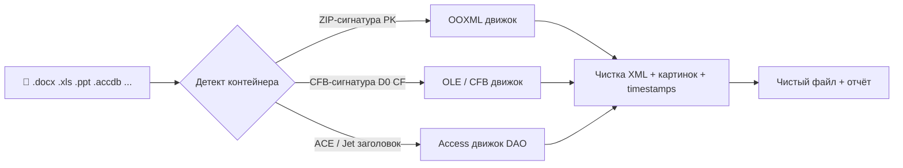

<p align="center">🌐 <a href="README.en.md">English</a> | <b>Русский</b></p>

<p align="center">
  
</p>

<h1 align="center">OfficeMetaCleaner 🧹</h1>

<p align="center">
  <b>Убирает скрытые метаданные из файлов Microsoft Office — и оставляет файлы полностью рабочими.</b><br/>
  Автор, компания, правки, геометки в фото, скрытые свойства баз — всё вычищается за секунды.
</p>

<p align="center">
  
  
  
  
  
  <a href="LICENSE"></a>
</p>

<p align="center">
  <code>GUI (drag &amp; drop)</code> · <code>CLI (omc)</code> · <code>OOXML</code> · <code>OLE / CFB</code> · <code>Access</code> · <code>EXIF в картинках</code>
</p>

> 📥 **Скачать готовое (Windows x64, .NET не нужен):** раздел
> **Releases** репозитория — `OfficeMetaCleaner-win-x64.zip` (GUI) и `omc-win-x64.zip` (консоль).
> Каждый тег `v*.*.*` автоматически собирает свежие portable `.exe` через GitHub Actions.

---

## ✨ Что это и зачем

Каждый `.docx`, `.xlsx`, `.pptx`, `.doc`, `.mdb` хранит гораздо больше, чем видно на экране:

>  кто создал и правил ·  компания и компьютер ·  когда и сколько правили ·
>  где и на что сняты встроенные фото ·  кто что комментировал ·  цифровые подписи

Отправляя такой файл клиенту, в суд, в резюме или в паблик — вы отправляете и всё это.

**OfficeMetaCleaner** — это кнопка «сделать файл безопасным»:

- кидаете файлы или папку в окно — получаете чистые копии;
- или гоняете пачкой через консоль `omc` в скриптах и CI;
- всё работает **строго локально**, без облаков и загрузок;
- содержимое, форматирование, формулы, макросы и правки **не трогаются** — режется только служебный слой.

---

## 🚀 Возможности

| | |
|---|---|
| 🖱️ **Drag & Drop GUI** | Тащите файлы и папки прямо в окно. Папки обходятся рекурсивно, интерфейс не виснет |
| 📋 **Честный отчёт по каждому файлу** | Клик / двойной клик по строке — окно «что именно удалено»: `[core-props] docProps/core.xml — удалена часть` |
| ⚙️ **Настройки с подсказками** | Чистка EXIF в картинках, удаление подписей, ожидание занятых файлов, privacy-флаги Word/PowerPoint |
| 🔁 **Умный повторный запуск** | Уже обработанные файлы пропускаются. Кнопка «Сбросить отметки» — обработать заново |
| 📂 **Гибкий вывод** | Копия рядом в `cleaned/`, в свою папку — или замена исходника `--in-place` |
| 🔒 **Ждёт открытые файлы** | Видит блокировку `~$...`, свободные обрабатывает первыми, занятые — по мере закрытия. `Отмена` / `Ctrl+C` — без потерь |
| 🧪 **`--dry-run`** | Режим «показать, что будет удалено, ничего не записывая» — для аудита |
| 🛡️ **Атомарная запись** | Сначала временный файл рядом с целью, потом замена. Сбой посередине = исходник цел |

---

## Как это работает?



Каждый формат чистится нативным для него способом:

### 1. OOXML (`.docx .docm .xlsx .xlsm .pptx .pptm .vsdx` …) — хирургия ZIP/OPC-пакета

Документ открывается как ZIP, правится точечно:

- 🗑️ удаляются части `docProps/core.xml`, `app.xml`, `custom.xml`, `thumbnail.*`;
- 🔗 синхронно чистятся `[Content_Types].xml` и `*.rels`, чтобы пакет остался валидным;
- 🧽 из остальных XML вычищаются `author`, `initials`, `creator`, `lastModifiedBy`, `company`, `manager`, `codeName`, даты — и **все `rsid`** (метки сеансов правок);
- 🛡️ выставляются privacy-флаги, чтобы Word/PowerPoint сами не копили мусор дальше:
  `removePersonalInformation` в `word/settings.xml`, `removePersonalInfoOnSave="1"` в `ppt/presentation.xml` (у Excel такого флага в формате просто нет);
- 🕒 timestamps ZIP-записей нормализуются к фиксированной дате;
- 📦 `vbaProject.bin` и остальное содержимое — **не трогаются**, макросы живут.

### 2. Legacy OLE/CFB (`.doc .xls .ppt .msg .vsd`) — через OpenMcdf

- контейнер пересобирается в новый файл;
- потоки `SummaryInformation` и `DocumentSummaryInformation` заменяются пустыми property-set'ами **на месте**, хвост добивается нулями — старые значения не остаются даже в «тени» потока.

### 3. Microsoft Access (`.accdb .accde .accdr .accdt .mdb .mde`) — через DAO

Это не ZIP и не CFB, а формат ACE/Jet, поэтому свойства правятся через `DAO.DBEngine.120`:

- удаляются свойства `SummaryInfo` и `UserDefined` (Title, Author, Company, Keywords …);
- убираются `AppTitle` и `AppIcon` (в иконке может лежать локальный путь);
- база **уплотняется (compact)** — иначе старые значения остались бы в освобождённых страницах.

> ⚠️ Для Access нужен установленный Microsoft Access или Access Database Engine.
> Если драйвер недоступен — утилита честно скажет об этом и **не тронет файл**.

### 4. Картинки внутри документов (`media/*`) — по умолчанию включено

Пиксели не меняются, режется только служебный слой:

| Формат | Что удаляется |
|---|---|
| **JPEG** | APP1 Exif/XMP, APP13 Photoshop/IPTC (в т.ч. геометки, модель камеры) |
| **PNG** | чанки `eXIf`, `tEXt`, `iTXt`, `zTXt`, `tIME` |
| **GIF** | комментарии и XMP application extension |

Отключается флагом `--keep-images` / галочкой в GUI.

---

## Что чистится?

| Где прячется | Пример | После чистки |
|---|---|---|
| Свойства файла | Автор, компания, заголовок, ключевые слова | ❌ удалено |
| История правок | `rsid`, `lastModifiedBy`, время редактирования | ❌ удалено (сами правки остаются!) |
| Настройки приватности | Word/PowerPoint копят авторов при каждом сохранении | ✅ включается «не копить» |
| Встроенные фото | GPS, камера, дата съёмки, XMP | ❌ удалено, фото целы |
| Старье `.doc/.xls/.ppt` | SummaryInformation в хвосте потока | ❌ занулено |
| Базы Access | SummaryInfo, AppTitle, пути в AppIcon | ❌ удалено + compact |
| ZIP-служебка | timestamps записей | 🕒 нормализовано к `2000-01-01` |
| Подписи `_xmlsignatures/*` | цифровые подписи | ⚠️ только с `--remove-signatures` |

### ❌ Что НЕ трогается

- текст, таблицы, формулы, слайды, форматирование;
- трек-правки как таковые (убирается только **авторство**, «принимать» правки за вас никто не будет);
- макросы `vbaProject.bin`;
- отдельные `.jpg/.png` на диске — чистятся только картинки **внутри** документов;
- поле «Владелец» во вкладке «Подробно» проводника — это ACL файловой системы, а не метаданные внутри файла (у копии на другом ПК там будет тот, кто записал файл).

---

## 🖥️ Графическое приложение (WPF)

Перетаскивание, живой список файлов (тип контейнера → статус → детали), шестерёнка настроек с подсказками при наведении, прогресс и кнопка «Открыть результат».

Настройки:

-  удалять EXIF изображений *(вкл.)*
-  удалять подписи *(выкл. — подписи станут недействительны)*
-  ждать закрытия занятых файлов *(выкл.)*
-  зачистка сведений о пользователе в Word/PowerPoint *(вкл.)*
-  заменять исходные файлы *(выкл. — по умолчанию пишется копия)*

Поведение вывода:

- по умолчанию — копия рядом: `cleaned\<имя>.<ext>`, при коллизии `имя (1).ext`, `имя (2).ext` …;
- либо замена исходника, либо своя папка;
- тестового прогона в GUI нет — для аудита есть `--dry-run` у консоли.

---

## ⌨️ Консольная утилита `omc`

```bash
omc clean <файл|папка> [--out <папка>] [--in-place] [--dry-run] [--recursive] [--remove-signatures] [--strip-images|--keep-images] [--wait] [--lang ru|en|auto]
```

Примеры:

```bash
# посмотреть, что будет удалено, ничего не записывая
omc clean договор.docx --dry-run

# почистить один файл (рядом появится договор.clean.docx)
omc clean договор.docx

# заменить исходник
omc clean договор.docx --in-place

# всю папку рекурсивно в свою папку, дождаться закрытия открытых файлов
omc clean .\docs --recursive --out .\docs-clean --wait

# строгий режим: снести и подписи тоже
omc clean .\docs --recursive --remove-signatures

# не трогать картинки
omc clean отчет.xlsx --keep-images
```

Вывод:

```text
Найдено файлов: 3
[OK] договор.docx -> договор.clean.docx (OOXML, dropped=3, scrubbed=12)
[core-props] docProps/core.xml — удалена часть
[author-attr] word/comments.xml — вычищен author
...
```

`Ctrl+C` во время `--wait` — аккуратно пропускает текущий занятый файл.

---

## 🛡️ Безопасность записи

Результат всегда пишется во временный файл рядом с целью и только потом атомарно заменяет её (`File.Move` с перезаписью):

- `--in-place` не оставит битый файл при сбое или отключении питания посередине;
- одинаково работает для OOXML и legacy CFB;
- занятые файлы определяются по `~$`-блокировке и прямой пробе записи.

---

## ⚡ Быстрый старт

Требуется **.NET SDK 8**.

```bash
dotnet build OfficeMetaCleaner.sln
dotnet test OfficeMetaCleaner.sln
```

### 📦 Портативные сборки (без установленного .NET — просто `.exe`)

Консоль:

```bash
dotnet publish src/OfficeMetaCleaner.Cli -c Release -r win-x64 --self-contained true `
  -p:PublishSingleFile=true -p:IncludeNativeLibrariesForSelfExtract=true `
  -p:EnableCompressionInSingleFile=true -o publish
```

GUI:

```bash
dotnet publish src/OfficeMetaCleaner.App -c Release -r win-x64 --self-contained true `
  -p:PublishSingleFile=true -p:IncludeNativeLibrariesForSelfExtract=true `
  -p:EnableCompressionInSingleFile=true -o publish-gui
```


## 🗂️ Структура решения

| Проект | Назначение |
|---|---|
| `src/OfficeMetaCleaner.Core` | Ядро: OOXML, OLE/CFB, Access, картинки (`net8.0`) |
| `src/OfficeMetaCleaner.App` | GUI на WPF (`net8.0-windows`) |
| `src/OfficeMetaCleaner.Cli` | Консоль `omc` (`net8.0`) |
| `tests/OfficeMetaCleaner.Core.Tests` | xUnit-тесты ядра |
| `assets/` | Иконка приложения |

Зависимости: `OpenMcdf 3.3.0` (legacy OLE/CFB). Для Access — DAO из Microsoft Access / Access Database Engine.

Ключевые файлы ядра:

- `MetadataScrubber.cs` — детект контейнера по сигнатурам `PK` / `D0 CF` / ACE-заголовку;
- `MetadataScrubber.Ooxml.cs`, `.XmlRewrite.cs`, `.Privacy.cs`, `.Paths.cs` — движок OOXML;
- `CfbScrubber.cs` — движок legacy;
- `AceDbScrubber.cs` — движок Access;
- `ImageMetadataStripper.cs` — движок картинок;
- `FileBusy.cs` — занятые файлы;
- `ScrubResultDetails.cs` — единый формат отчёта для GUI и CLI.


---

## ❓ FAQ

**Подписи после чистки слетают?**
Да — это свойство формата: любая правка делает цифровую подпись недействительной. Сами `_xmlsignatures/*` при этом удаляются только с явным `--remove-signatures`.

**Файл точно откроется в Word/Excel?**
Проверяется структурная валидность пакета и контейнеров + набор автотестов. Макросы, формулы и содержимое не переписываются.

**Почему «Владелец» в проводнике не убрался?**
Это владелец файла в NTFS (ACL), а не данные внутри `.accdb`/`.docx`. Очисткой метаданных его убрать нельзя и не нужно — на другом компьютере там будет тот, кто записал копию.

**А облачные аналоги?**
Здесь всё локально: файл никуда не загружается. Для договоров, резюме, судебных и корпоративных документов это критично.

---

## 📄 Лицензия

MIT © 2026 Snejniy 00DaEdRa00 — можно использовать, менять и распространять с сохранением копирайта. См. [LICENSE](LICENSE).

Сторонние компоненты: `OpenMcdf` (MPL-2.0). Для баз Access нужен установленный Microsoft Access / Access Database Engine — он не распространяется с программой.

---

<p align="center">
  <b>Кинул файл — получил чистый файл. Без облаков, без следов, без сюрпризов. 🧹</b>
</p>
